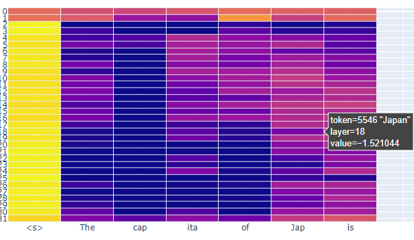
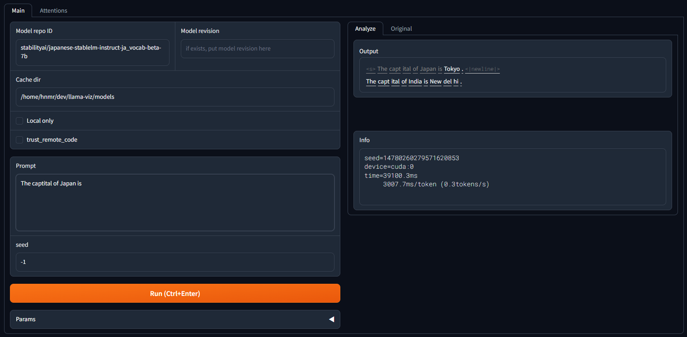
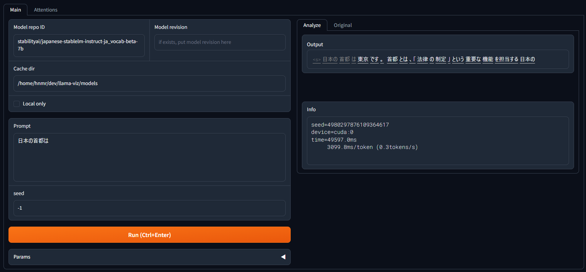
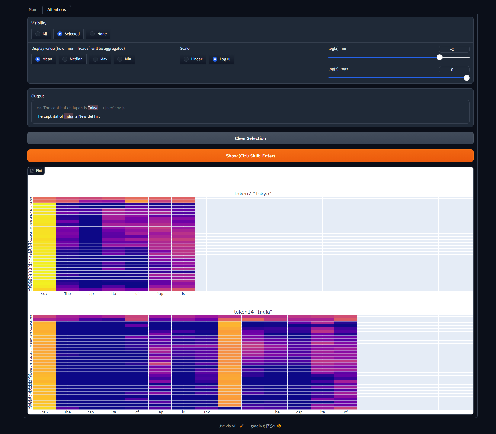

# LLaMA-Viz

## What is this?

The attention map viewer for LLaMA models.

## Usage

1. Run `$ python main.py`.
2. Input model information and the prompt in `Main` tab.
3. Click `Run` button.
4. Open `Attentions` tab. Select tokens you are interested in, then click `Show` button.

The horizotal axis represents the index of the context used to output the new token. The corresponding input tokens are shown for reference.

The vertical axis represents the number of the LLaMA's self-attention layer.

The color of the tile indicates the value of the attention weight. Bright (yellow) is high. 
For example, the following image shows that the 19th layer's attention weight at 6th position of the context is `0.03`. NB. in the image, the value is shown on a log10 scale. 10^(-1.52) ≒ 0.03.



The higher the value, the more we can assume that the output value is heavily influenced by that position of the context.

Attention weights have as many values as heads. The aggregation method can be chosen from `Mean`, `Median`, `Max` and `Min`.

## Installation

```bash
$ pip install -r requirements.txt
```

`cu118` version:

```bash
$ pip install wheel
$ pip install torch torchvision torchaudio --index-url=https://download.pytorch.org/whl/cu118
$ pip install accelerate "transformers>=4.34.1" optimum gradio
$ pip install auto-gptq --extra-index-url=https://huggingface.github.io/autogptq-index/whl/cu118/
$ pip install -r requirements.txt
```

## Examples

### Main Tab





### Attention Tab


